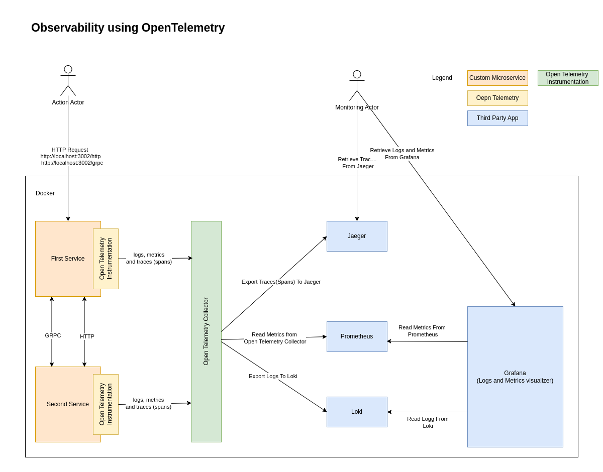

# Observability - NestJS

## Nestjs Observability using Open telemetry

The goal of this experimet was to add observabily to an existing microservices environment without touching the microservices code at all.

### Tech stack:  
**Microservices**:
- nestjs (as framework)
- winston ( logger )
- GRPC and HTTP communication


**Observability**:
- Open Telemetry Collector - a central hub for the observability with a lot of options for export
- Jaeger (Traces/Spans) - Collector and Visualiztion
- Prometheus - Metrics collector
- Loki - Logs Collector
- Grapfana - Logs and Metrics Visualization


### Diagram:  
  


### How to run it   

```
docker compose up -d
```

Open the browser and navigate several times to:  
http://localhost:3002/grpc (GRPC first service to second service communication) 
http://localhost:3002/http  (HTTP first service to second service communication)


**Checks the results in**:  
Jaeger: http://localhost:16686/  
Grafana: http://localhost:3000/

For Grafana you could go to:  
Home -> Explore -> ...  
and select Loki or Prometheus as source.  

**Additional Notes**:  
Still in progress ...   
- Logs doesn't work well with rxjs (TODO: provide more info)  
- Logs inside a microservice without trace ID are not exported  


